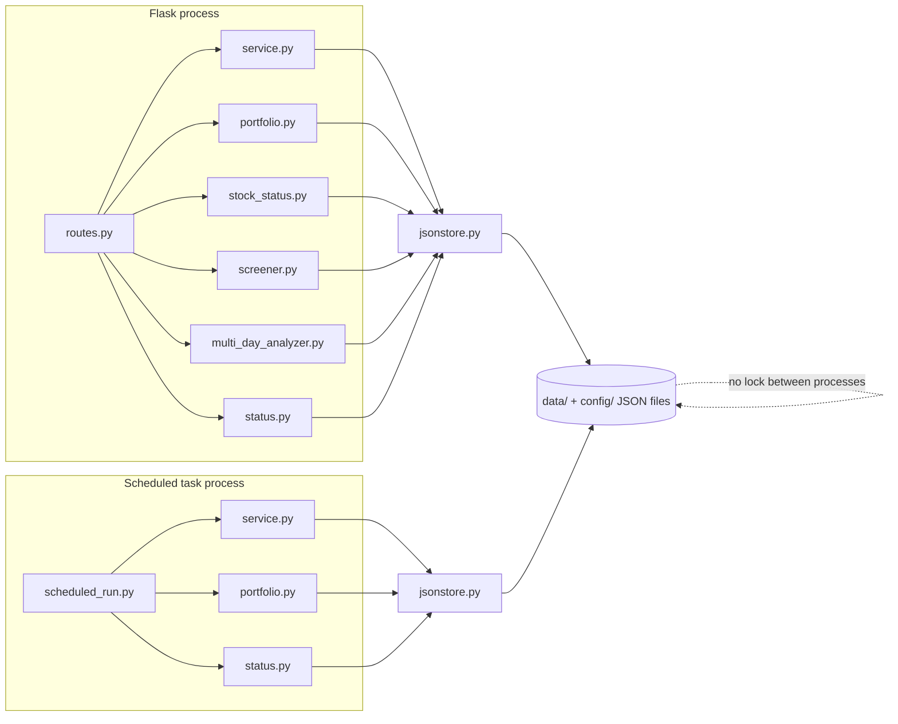
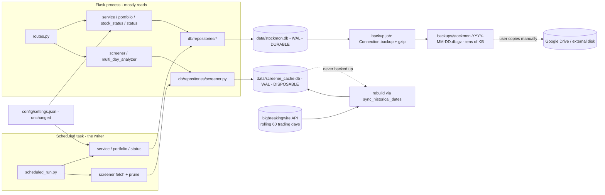

# Data Storage Architecture Review & Migration Plan

**Project:** Daily Updater (Portfolio and Stock Monitor)
**Date:** 2026-09-06
**Audience:** Intermediate developer implementing the change
**Status:** Recommendation — approved direction, ready for implementation

---

## 0. Executive summary

| Question | Answer |
| --- | --- |
| Is the current JSON-file storage still adequate? | **No.** It works today only because the dataset is small and the app has one user. Two of its properties are already failing: unbounded growth (~3.5 GB/year) and multi-process write safety. |
| Should we migrate to a database? | **Yes.** |
| Which database? | **SQLite**, accessed with Python's built-in `sqlite3` module in **WAL mode**. No server, no new runtime to install. |
| How many database files? | **Two.** `data/stockmon.db` holds irreplaceable data and is backed up. `data/screener_cache.db` holds screener history, is **never backed up**, and is disposable — it can be rebuilt from the upstream API. |
| Anything stay as files? | **Yes** — `config/settings.json` stays a file, and `logs/` stays as-is. Everything else under `data/` and `config/portfolios.json` moves into one of the two databases. |
| How does cloud backup work? | The **live database never lives in a synced folder.** A scheduled job writes a consistent, compressed snapshot of `stockmon.db` only to `backups/`, and the user copies that folder to Google Drive / an external disk. Restore is a guided flow in the UI. |
| How big is a backup? | **Tens of KB compressed** — because screener data is excluded. See §6.0. |
| Does this survive the upcoming Portfolio Tracker feature? | Yes — that feature is genuinely relational (holdings → buy lots → sold records → dividends → notes) and is the single strongest argument for making this move *before* it is built, not after. |
| Effort shape | One cutover. Roughly: schema + access layer, a one-shot importer for existing JSON, module-by-module swap of `read_json`/`write_json` calls, then backup/restore. |

**The one-line reason:** you are about to add a feature with real relationships, real money in it, and an editing workflow (buy → average → partially sell → move to Sold), on top of a storage layer whose only write primitive is *"rewrite the entire file."* That combination is where file-based storage stops being simple and starts being a liability.

### 0.1 The durable/disposable split

Screener data is **reproducible** — it comes from `bigbreakingwire.in` and the app already has [`sync_historical_dates()`](../stockmon/multi_day_analyzer.py#L67) to re-fetch it. Everything else is **irreplaceable** — it is user-authored and exists nowhere else in the world.

This distinction is the most useful architectural line in the whole system, and it drives the two-file design:

| | `data/stockmon.db` | `data/screener_cache.db` |
| --- | --- | --- |
| **Contains** | Portfolios, holdings, buy lots, sales, dividends, stock status, tracker snapshots, sync state, quote cache | Screener day/row history, derived analysis |
| **Origin** | Typed by the user. Gone forever if lost. | Fetched from an API. Re-fetchable on demand. |
| **Size** | Tens of KB, growing slowly | Hundreds of MB, growing ~daily |
| **Backed up** | **Yes** — every scheduled run | **No** — never |
| **If deleted** | Restore from backup (§6.4) | Re-run the sync; app repopulates itself |
| **Retention** | Forever | 60 trading days (§5.3) |

**Why this matters more than it first appears:** it removes 99.9% of the bytes from the backup path. A backup stops being a multi-megabyte archive that must be scheduled carefully and becomes a **tens-of-kilobytes file you could email to yourself.** That, in turn, means backups can run more often, retention can be much longer, verification is instant, and the manual copy-to-Drive step you asked for takes a second. Nearly every awkward part of the original backup design was awkward *because* of screener data.

> **One caveat, and it is a real one.** The upstream API exposes a **rolling 60-trading-day window** — the `dates` array in the current screener response holds exactly 60 entries, back to 2026-06-12. So "re-fetchable" means *re-fetchable for the last 60 trading days.* Anything older exists only on your disk. §5.3 sets local retention to match that window so the two stay consistent. **If Phase 2 ever needs more than 60 days of screener history, that older data becomes irreplaceable and must move into the backed-up database.** Flagged in §9.

---

## 1. What the code actually does today

This section is the evidence base. Everything below was read out of the repository, not assumed.

### 1.1 There is exactly one storage primitive

All persistence funnels through two functions in [stockmon/jsonstore.py](../stockmon/jsonstore.py):

```python
read_json(path, default=None)   # parse a file, or return default
write_json(path, payload)       # serialize whole object -> temp file -> os.replace()
```

`write_json` is genuinely well written for what it is: it writes to a temp file in the same directory, `fsync`s it, then `os.replace()`s it into position. `os.replace` is atomic on both Windows and POSIX, so a reader never sees a half-written file. That is the right technique, and it is worth keeping in mind that the problems below are *not* sloppiness — they are the inherent ceiling of the whole-file-rewrite model.

File locations are centralized in [stockmon/paths.py](../stockmon/paths.py), all overridable via `STOCKMON_CONFIG_DIR` / `STOCKMON_DATA_DIR` / `STOCKMON_LOG_DIR`. That indirection is a gift — it means the migration has one obvious seam to cut at.

### 1.2 The stores, their owners, and their real sizes

| Store | Owner module | Purpose | Size today | Growth |
| --- | --- | --- | --- | --- |
| `data/screener/screener_<date>.json` | [screener.py](../stockmon/screener.py) | One full market screener snapshot per trading day | **~14 MB × 19 files ≈ 266 MB** | +14 MB every trading day, never pruned |
| `data/screener/multi_day_analysis_cache.json` | [multi_day_analyzer.py](../stockmon/multi_day_analyzer.py) | Derived 11-day trajectory analysis | **16.8 MB** | Rewritten whole on each recompute |
| `data/snapshot.json` | [service.py](../stockmon/service.py) | Rendered Tracker table (prices, EMAs, signals) | 99 KB | Bounded by portfolio size |
| `data/screener_cache.json` | screener.py | Index of which dates are saved + API nonce | 4 KB | Bounded |
| `data/stock_status.json` | [stock_status.py](../stockmon/stock_status.py) | User-authored analysis records | 2.8 KB | Grows with user input |
| `data/quotes_cache.json` | [data_fetcher.py](../stockmon/data_fetcher.py) | Last-known price fallback cache | 1.4 KB | Bounded by ticker count |
| `data/status.json` | [status.py](../stockmon/status.py) | Integer version counter driving SSE | 0.2 KB | Fixed |
| `data/pending_additions.json` | [portfolio.py](../stockmon/portfolio.py) | Queue of UI-added tickers for next scheduled run | 0.1 KB | Drains to empty |
| `config/portfolios.json` | portfolio.py | BAPA / MADI ticker lists | 0.8 KB | Bounded |
| `config/settings.json` | [config_manager.py](../stockmon/config_manager.py) | Schedule times, EMA periods, retry limits | 0.5 KB | Fixed |

**Read that table again with one thing in mind:** 99.9% of the bytes are screener data. Everything else combined is under 130 KB. This is not one storage problem; it is two, and they need different answers within the same database.

### 1.3 The screener payload, measured

A single day's file (`screener_2026-09-04.json`) contains:

- **3,444 items** (one per listed company)
- **127 fields per item**
- Top-level envelope keys: `success, date, timeframe, total, items, page, per_page, dates, insufficient, unavailable, message, premium_access, execution_id, source`

That is ~437,000 individual values per day, serialized as pretty-printed JSON (`indent=2`). The pretty-printing matters more than you'd think: every one of those 437,000 values carries its field name as a repeated literal string plus indentation whitespace. Field names alone — repeated 3,444 times each — account for a large fraction of the 14 MB. The actual information content is far smaller than the file.

### 1.4 Two processes, one dataset

Two independent OS processes read and write these files:

1. **The Flask app** — [app.py](../app.py), binding `127.0.0.1:5000` by default, running Flask in a daemon thread behind a `pywebview` desktop window.
2. **The scheduled task** — [scheduled_run.py](../scheduled_run.py), launched by Windows Task Scheduler on weekdays (via `scripts/run_scheduled.ps1`).

They coordinate through `data/status.json`: `status.bump()` increments an integer `version`, and the SSE endpoint at `/api/stream` ([routes.py](../stockmon/web/routes.py#L218)) polls `read_status()` in a loop and pushes an event to the browser when the number changes. It is a simple, effective design.

### 1.5 The concurrency guarantee is narrower than it looks

`jsonstore.py` holds a module-level `threading.Lock` around writes:

```python
_WRITE_LOCK = threading.Lock()
```

A `threading.Lock` only synchronizes **threads inside one Python process**. It does nothing between the Flask process and the scheduled-run process. The module docstring is honest about this — it says the two processes "never write the same file concurrently in normal operation."

That assumption does not hold in the code as written. Concrete example, `data/pending_additions.json`:

- The Flask app, when the user adds a ticker, calls `record_addition()` → [portfolio.py](../stockmon/portfolio.py#L161): read the list, append, write the list.
- The scheduled run calls `consume_pending_additions()` → [portfolio.py](../stockmon/portfolio.py#L171): read the list, write back `[]`.

If the user clicks "Add ticker" at 09:30:00 while the scheduled task is draining the queue, one of the two read-modify-write cycles overwrites the other. The ticker is silently lost. No error, no log line. The same shape of race exists for `status.json` (two `bump()` calls could produce the same version number) and for `screener_cache.json`.

This is the classic **lost update** problem, and it is not fixable with atomic file replacement — atomic replacement guarantees you never see a *torn* file, but it happily lets you overwrite someone else's complete file. Fixing it properly requires either OS-level file locking or a transactional store.

### 1.6 Corruption handling loses data quietly

When `read_json` hits a `json.JSONDecodeError`, it calls `_quarantine()`, which renames the file to `<name>.json.corrupt`, then returns the caller's `default`.

For `stock_status.json` the default is `[]`. So a corrupt file produces this sequence:

1. App starts, sees empty list, renders an empty Stock Status tab.
2. User adds one entry.
3. `save_stock_statuses()` writes a fresh file containing exactly that one entry.

The original data still exists on disk as `stock_status.json.corrupt`, but nothing in the UI mentions it, nothing surfaces it, and the user's mental model is "my data vanished." The quarantine is a good instinct; the missing half is that **nobody is told**.

### 1.7 Read amplification in the analyzer

`analyze_multi_day_sequences()` in [multi_day_analyzer.py](../stockmon/multi_day_analyzer.py#L124) needs 13 specific fields per stock per day (`close, open, high, low, volume, delivery_qty, delivery_percent, supertrend_dir, sma_20, close_near_high_pct, volume_ratio_20, range_pct_5, pct_change`).

To get those 13 fields, it must `json.load()` each entire 14 MB file — all 127 fields of all 3,444 stocks — and then discard ~90% of it. Across 11 days that is **~154 MB parsed to extract roughly 15 MB of relevant numbers**.

The code already contains the workarounds this forces: a projection step that strips fields after parsing, an in-memory cache keyed on file mtimes, and a 16.8 MB on-disk result cache. Those are three separate mechanisms, all existing to compensate for the fact that the storage layer cannot answer "give me these 13 columns for these 11 dates." A database answers that in one query, with no cache needed.

### 1.8 Current data flow



---

## 2. Is the current approach adequate?

Scored against how the project is actually used and where it is going.

| Dimension | Verdict | Detail |
| --- | --- | --- |
| **Correctness under concurrency** | ❌ Failing now | Cross-process lost updates are possible today (§1.5) and the window widens as more UI actions write data. |
| **Storage growth** | ❌ Failing soon | ~14 MB per trading day, never pruned. ~250 trading days/year ⇒ **~3.5 GB/year** of local disk consumed holding data the API will hand back on request. |
| **Query capability** | ❌ Failing now | "Show me RELIANCE's close and delivery% over the last 30 days" requires loading 30 × 14 MB and filtering in Python. Phase 2 of the new feature is exactly this query, repeatedly. |
| **Partial updates** | ❌ Blocking the new feature | Editing one holding's LTP rewrites the entire holdings file. Fine at 10 rows; wrong in principle, and it makes per-row audit history impossible. |
| **Durability / backup** | ❌ No strategy | No backup exists. A disk failure loses every holding, status record and portfolio you have ever entered. The screener history would go too — but that part is re-fetchable, which is the insight §0.1 is built on. |
| **Failure visibility** | ⚠️ Weak | Corruption silently degrades to defaults (§1.6). |
| **Simplicity** | ✅ Genuinely good | Human-readable, greppable, no dependencies, trivially inspectable. This is real value and the migration should preserve as much of it as possible. |
| **Config editing** | ✅ Good | `settings.json` being hand-editable is a feature, not an accident. Keep it. |

### 2.1 Why the new feature is the deciding factor

[requirment.md](../requirment.md) specifies the Portfolio Tracker tab. Strip away the UI and here is its data model:

```
portfolio (BAPA | MADI | LOAN)
  └── holding (one per ticker per portfolio)
        ├── buy_lot        (1..n — §2.2: "bought several times at different prices")
        ├── notes          (bought reason / sold reason / mistake-learned — §6)
        └── sale           (§4: moves to a separate Sold table, same columns)
  └── dividend             (symbol, value, date — §7)
  └── summary_value        (fixed user-entered values — §8)
```

Look at what the requirements ask for:

- **§2.2 weighted-average across multiple buy lots** — that is `SUM(qty * price) / SUM(qty)` grouped by holding. One line of SQL; a nested aggregation loop in Python over JSON.
- **§5 totals rows** — `SUM()` with `GROUP BY portfolio`.
- **§8 Block B "Stock Profit = LOAN Earned − LOAN Loss"** — a cross-table aggregate.
- **§6 follow-up "a consolidated view listing all Mistake/Learned entries in one place"** — `SELECT ... WHERE mistake_learned IS NOT NULL ORDER BY date`. In a per-portfolio JSON file layout, this means opening every file and scanning.
- **§9 Tracker auto-population** — MADI Tracker = MADI holdings ∪ LOAN holdings where `person = 'MADI'`. A `WHERE ... OR ...` clause; in JSON, a hand-written join across two files that must stay in sync.
- **§10 Phase 2** — "using the saved Screener data (current and previous days), analyse a stock." Per-symbol time series lookup across history. This is the query pattern §1.7 already struggles with.
- **§11 Phase 3** — average buy price joined against the Tracker snapshot per ticker. Another join.

Every one of those is a one-to-many relationship or an aggregate. That is the textbook definition of relational data. Building it on JSON files means hand-writing joins and aggregations in Python, and hand-maintaining referential integrity (nothing stops a `sale` row referencing a deleted `holding`).

And critically, [requirment.md](../requirment.md) **Open Question #4** asks precisely this: *"Storage location for holdings — new JSON files under `data/` (consistent with the existing store) or elsewhere."* This document is the answer: **elsewhere — SQLite.** Answering it now costs a migration. Answering it after the feature ships costs a migration *plus* a rewrite of the feature *plus* a second data conversion of real money records.

---

## 3. Options considered

Four realistic paths. All were evaluated against: two-process safety, growth, the new feature's relational needs, the "maybe phone/web later" possibility, and implementation cost.

### Option A — Keep JSON, add backups and pruning only

Add a backup script and delete screener files older than 90 days.

- **Pros:** Smallest change. Zero new concepts.
- **Cons:** Solves the growth and durability symptoms, none of the structural ones. The lost-update races remain. The new feature still gets built on whole-file rewrites. You will be reading this document again in six months.
- **Verdict:** Rejected. It's a patch on the two problems that were easiest to see, and it leaves the two that will actually hurt.

### Option B — SQLite ✅ recommended

One file, `data/stockmon.db`, via Python's built-in `sqlite3`.

- **Pros:**
  - **Zero install.** SQLite is compiled into CPython. No service, no port, no credentials, no Docker. It ships with your app the way `json` does.
  - **Real transactions.** `BEGIN … COMMIT` is atomic and durable. Two processes cannot lose each other's writes.
  - **WAL mode fixes your exact concurrency shape** (explained in §4.2): many concurrent readers + one writer, which is precisely "Flask serving the UI while the scheduler writes."
  - **Single-file portability.** Copying `stockmon.db` to another PC moves everything. This directly serves your "transferable to a different PC" requirement — and it's *better* than today, where you must copy a whole directory tree and hope nothing was mid-write.
  - **Massive size reduction on screener data.** Typed columns instead of repeated field-name strings and indentation.
  - **Online backup API.** `sqlite3.Connection.backup()` produces a consistent snapshot *while the database is in use*. This is the linchpin of the whole backup plan (§6).
  - **Indexes.** `WHERE symbol = ? AND date >= ?` goes from "parse 154 MB" to a sub-millisecond index seek.
- **Cons:**
  - Data is no longer greppable in a text editor. Mitigated by DB Browser for SQLite (free GUI), the `sqlite3` CLI, and a JSON export command you should build (§8.4).
  - **One writer at a time.** For a single-user desktop app this is a non-issue; call it out honestly so nobody is surprised.
  - **A live SQLite file must never sit in a cloud-synced folder.** Non-negotiable — see §6.1. This is a real constraint, not a footnote.
- **Verdict:** **Recommended.**

### Option C — PostgreSQL (or MySQL)

- **Pros:** True multi-writer concurrency. The right answer if this ever becomes a genuine multi-user web service.
- **Cons:** Requires installing and running a server on the user's Windows PC, managing credentials, and — worst of all here — backup means `pg_dump` rather than "copy this file." That directly conflicts with your stated backup workflow of copying to Drive or an external disk.
- **Verdict:** Rejected **for now**, deliberately kept reachable. See §4.3 for how the design keeps the door open at low cost.

### Option D — A cloud-hosted database (Firebase, Supabase, MongoDB Atlas, …)

- **Pros:** Sync and backup are someone else's problem. Phone access comes nearly free.
- **Cons:** The app stops working offline. Financial holdings live on a third party's servers. Free tiers change terms. You told me you want manual copy-to-Drive control, which is the opposite of this model.
- **Verdict:** Rejected.

---

## 4. Recommendation: SQLite

### 4.1 The engine

**SQLite**, accessed through Python's standard-library `sqlite3` module. No new runtime dependency. Two files, per the §0.1 split:

```
data/stockmon.db         # durable, backed up, tiny
data/screener_cache.db   # disposable, never backed up, large
```

Connection settings to apply on **every** connection, in this order:

```python
import sqlite3

def connect(path):
    conn = sqlite3.connect(path, timeout=30.0, isolation_level=None)
    conn.row_factory = sqlite3.Row
    conn.execute("PRAGMA journal_mode = WAL")      # persistent; set once, stays set
    conn.execute("PRAGMA busy_timeout = 30000")    # 30s — wait, don't fail
    conn.execute("PRAGMA foreign_keys = ON")       # per-connection; must be set every time
    conn.execute("PRAGMA synchronous = NORMAL")    # safe with WAL; much faster than FULL
    return conn
```

What each one buys you:

- **`journal_mode = WAL`** (Write-Ahead Logging) — see §4.2. Set once, persists in the file.
- **`busy_timeout = 30000`** — if another process holds the write lock, wait up to 30 seconds instead of immediately raising `database is locked`. Without this, a scheduled run overlapping a UI click throws an error. With it, one simply waits a few milliseconds. **This is the single most commonly skipped setting and the cause of most "SQLite doesn't handle concurrency" complaints.**
- **`foreign_keys = ON`** — SQLite has foreign keys but defaults them **off** for backward compatibility. It is per-connection, so it must be re-issued every time. Forget it and your `holding_id` references silently stop being enforced.
- **`synchronous = NORMAL`** — with WAL this is the recommended durability/speed balance. `FULL` fsyncs on every commit; `NORMAL` still survives application crashes and only risks the most recent transactions on a hard OS/power failure. For a personal dashboard with daily backups, that's the right trade.
- **`isolation_level=None`** — turns off Python's implicit transaction magic so you control `BEGIN`/`COMMIT` explicitly. Less surprising than the default.

### 4.1a Querying across both databases

Splitting into two files raises an obvious question: what about Phase 2 and Phase 3, which need to combine holdings with screener history?

SQLite answers this with `ATTACH DATABASE`. One connection can open several database files and join across them as if they were one:

```python
conn = connect(paths.DB_FILE)
conn.execute("ATTACH DATABASE ? AS screener", (str(paths.SCREENER_DB_FILE),))

conn.execute("""
    SELECT h.symbol, s.close, s.pct_change, s.supertrend_dir
    FROM holding h
    JOIN screener.screener_row s ON s.symbol = h.symbol
    WHERE h.portfolio_name = ? AND h.status = 'open'
      AND s.trade_date = (SELECT MAX(trade_date) FROM screener.screener_row)
""", ("MADI",))
```

The attached database gets a schema prefix (`screener.`), and joins, indexes and the query planner all work normally across the boundary. Two rules:

- **A transaction spanning attached databases is not atomic across both files.** SQLite tries, but a crash at exactly the wrong moment can commit one and not the other. Irrelevant here — you only ever *read* from the screener DB inside these joins, and writes to each database happen in their own separate transactions.
- **Attach lazily**, only in the code paths that need it (Phase 2 analysis, Phase 3 risk column). Routine Tracker and Status requests should not attach a 200 MB database they will not touch.

So the split costs you almost nothing in query power, and buys the entire §0.1 backup simplification.

### 4.2 What WAL mode actually does, and why it matters here

In SQLite's default `journal_mode = DELETE`, a writer copies the original pages into a rollback journal, then modifies the main database file in place. Because the main file is being mutated, **readers are blocked while a write is in progress, and a writer is blocked while any read is in progress.**

In **WAL** mode this inverts. Writers append new pages to a separate `stockmon.db-wal` file and leave the main database untouched. Readers keep reading the main file at a consistent point in time. The consequences:

- **Readers never block the writer. The writer never blocks readers.**
- Still **only one writer at a time** — a second writer waits (which is what `busy_timeout` is for).

Map that onto your app: the Flask process is almost entirely a reader (serving tables, streaming SSE, rendering the screener tab), and the scheduled task is the writer. WAL is essentially designed for this shape. Compared with today's `threading.Lock` — which provides *no* cross-process protection at all — this is a strict, unambiguous upgrade.

Two operational notes:

- WAL creates sidecar files `stockmon.db-wal` and `stockmon.db-shm` next to the main file. They are normal. Do not delete them while the app is running, and **never copy the `.db` file alone while the app is running** — the `-wal` may hold committed data not yet folded into the main file. (§6 handles this correctly.)
- WAL requires real shared-memory support, which means **the database file must be on a local disk** — not a network share, not a cloud-sync virtual filesystem. Another reason for §6.1.

### 4.3 Keeping the Postgres door open (cheaply)

You mentioned phone/web access as a maybe. Here is the honest positioning:

- SQLite handles **remote access** fine — you'd keep the Flask app as the only thing touching the DB and expose it over the network (with authentication added, which the app currently has none of; it binds `127.0.0.1` and is unauthenticated by design). SQLite is not the bottleneck for that.
- SQLite would only become genuinely wrong if you needed **multiple independent processes on different machines writing concurrently**. That's a different product.

So: don't pay for Postgres now. Pay a small, cheap insurance premium instead:

1. **All SQL lives in `stockmon/db/repositories/`.** No module outside that package writes SQL. Business logic calls `holdings_repo.list_for_portfolio("MADI")`, never `conn.execute("SELECT ...")`. If you ever swap engines, you rewrite one package.
2. **Prefer portable SQL.** Avoid SQLite-only syntax where a standard form exists. The one place you'll deliberately break this rule is the screener `payload` column (§5.3) — accept it, and note it in a comment.
3. **Version the schema from day one** (§5.6) so a future migration has a defined starting point.

That's maybe half a day of discipline, and it converts "we'd have to rewrite the app" into "we'd have to rewrite one package."

> **Note on ORMs.** SQLAlchemy + Alembic is a perfectly good alternative to hand-written SQL and would give you migrations for free. It is not recommended here because this schema is small, the queries are simple, the repository pattern already gives you the isolation an ORM would, and adding a dependency complicates any future PyInstaller packaging. If you're already comfortable with SQLAlchemy, using it changes nothing else in this plan.

---

## 5. Target schema

Three groups of tables: **existing data**, **screener data** (which needs special handling), and **the new Portfolio Tracker feature**.

### 5.1 Naming and type conventions

- `snake_case` for tables and columns.
- **Dates as `TEXT` in `YYYY-MM-DD`; timestamps as ISO-8601 `TEXT` with offset.** SQLite has no native date type, and ISO-8601 sorts correctly lexicographically. This also matches what the code already produces (`datetime.now(timezone.utc).astimezone().isoformat()`).
- **Money and quantities as `REAL`.** Not ideal in the abstract — binary floating point can't represent 0.1 exactly, so summing thousands of rows can drift by fractions of a paisa. It is acceptable here because this is a personal P&L dashboard, not a ledger of record, and it keeps arithmetic simple. *If you ever want exactness, store paise as `INTEGER` and divide by 100 at the display layer. Decide this now — changing it later means migrating every numeric column.*
- Every mutable row gets `created_at` and `updated_at`.

### 5.2 Group 1 — existing data → `stockmon.db` (backed up)

```sql
-- config/portfolios.json
CREATE TABLE portfolio (
    name        TEXT PRIMARY KEY,             -- 'BAPA' | 'MADI' | 'LOAN'
    kind        TEXT NOT NULL DEFAULT 'personal',
    created_at  TEXT NOT NULL
);

CREATE TABLE portfolio_ticker (
    portfolio_name TEXT NOT NULL REFERENCES portfolio(name) ON DELETE CASCADE,
    symbol         TEXT NOT NULL,             -- normalized, e.g. 'RELIANCE.NS'
    added_at       TEXT NOT NULL,
    PRIMARY KEY (portfolio_name, symbol)
);
```

The composite primary key gives you, for free, the duplicate check currently hand-written in `add_ticker()`.

```sql
-- data/pending_additions.json
CREATE TABLE pending_addition (
    id             INTEGER PRIMARY KEY AUTOINCREMENT,
    portfolio_name TEXT NOT NULL,
    symbol         TEXT NOT NULL,
    added_at       TEXT NOT NULL,
    consumed_at    TEXT                        -- NULL = still pending
);
CREATE INDEX idx_pending_unconsumed ON pending_addition(consumed_at) WHERE consumed_at IS NULL;
```

This kills the §1.5 race outright. `consume_pending_additions()` becomes a single transaction:

```sql
BEGIN IMMEDIATE;
SELECT id, portfolio_name, symbol, added_at FROM pending_addition WHERE consumed_at IS NULL;
UPDATE pending_addition SET consumed_at = ? WHERE consumed_at IS NULL;
COMMIT;
```

A ticker added mid-transaction lands *after* the `UPDATE`'s snapshot and is simply picked up next run. Nothing is lost. Note `BEGIN IMMEDIATE` rather than plain `BEGIN` — it takes the write lock up front, which prevents the "upgrade a read transaction to a write transaction" case that can fail with `SQLITE_BUSY` even when `busy_timeout` is set. **Use `BEGIN IMMEDIATE` for every read-modify-write transaction.**

```sql
-- data/status.json
CREATE TABLE sync_state (
    id         INTEGER PRIMARY KEY CHECK (id = 1),   -- single-row table
    version    INTEGER NOT NULL DEFAULT 0,
    updated_at TEXT,
    source     TEXT,
    message    TEXT,
    summary    TEXT                                   -- JSON blob, rendered as-is
);
```

`status.bump()` becomes `UPDATE sync_state SET version = version + 1, ... WHERE id = 1` — atomic at the database level, so two concurrent bumps can never produce the same version. The SSE loop in [routes.py](../stockmon/web/routes.py#L218) keeps polling `read_status()` and needs no change beyond the repository swap.

```sql
-- data/snapshot.json
CREATE TABLE tracker_snapshot (
    id           INTEGER PRIMARY KEY AUTOINCREMENT,
    generated_at TEXT NOT NULL,
    source       TEXT,
    payload      TEXT NOT NULL                        -- full rendered snapshot JSON
);
CREATE INDEX idx_snapshot_generated ON tracker_snapshot(generated_at DESC);
```

`snapshot.json` is a rendered view, not source data — nothing queries *into* it, and its shape is coupled to `_render_tables()`. Keep it as an opaque JSON blob. Storing it as rows would be over-normalization for zero benefit. The bonus: keeping the last ~30 rows gives you snapshot history you don't have today.

```sql
-- data/quotes_cache.json
CREATE TABLE quote_cache (
    symbol     TEXT PRIMARY KEY,
    price      REAL,
    currency   TEXT,
    name       TEXT,
    fetched_at TEXT NOT NULL
);

-- data/stock_status.json
CREATE TABLE stock_status (
    id                 TEXT PRIMARY KEY,               -- keep the existing uuid4 strings
    symbol             TEXT NOT NULL,
    name               TEXT,
    date_of_analysis   TEXT NOT NULL,
    price_of_analysis  REAL,
    best_entry         REAL,
    status             TEXT,                           -- Buy | Avoid | Hold | Acc on dip
    base_low  REAL, base_high  REAL,
    bull_low  REAL, bull_high  REAL,
    bear_low  REAL, bear_high  REAL,
    remarks            TEXT,
    created_at         TEXT NOT NULL,
    updated_at         TEXT NOT NULL
);
CREATE INDEX idx_stock_status_symbol ON stock_status(symbol);
```

Note the `base`/`bull`/`bear` two-element arrays become explicit `_low`/`_high` columns. Same information, but now `WHERE bull_high > ?` is expressible.

`config/settings.json` **stays a file.** It is configuration, not data: hand-edited, tiny, version-controllable, and needed before the DB connection exists (the DB path itself could become a setting). Putting bootstrap configuration inside the thing it configures is a circular dependency you don't need. [config_manager.py](../stockmon/config_manager.py) is unchanged by this migration.

### 5.3 Group 2 — screener data → `screener_cache.db` (disposable, never backed up)

This entire group lives in the **second** database file. Nothing here is backed up, because all of it can be re-fetched (§0.1).

**The problem.** 3,444 rows × 127 columns × ~250 days/year. Two naive designs, both wrong:

- *Store the whole day's JSON in one `TEXT` column.* Reproduces today's problem inside a database. Reading one symbol still means parsing 14 MB.
- *Create 127 typed columns.* Brittle — the upstream `bigbreakingwire` API adds or renames a field and you're writing a schema migration. And you don't know which of the 127 you'll want next year.

**The recommended design: hybrid — one row per (date, symbol), hot fields promoted to real columns, the rest kept as JSON.**

```sql
CREATE TABLE screener_day (
    trade_date   TEXT PRIMARY KEY,             -- 'YYYY-MM-DD'
    fetched_at   TEXT NOT NULL,
    total_items  INTEGER NOT NULL,
    timeframe    TEXT,
    source       TEXT,
    envelope     TEXT                          -- non-item top-level keys (dates, message, ...)
);

CREATE TABLE screener_row (
    trade_date          TEXT NOT NULL REFERENCES screener_day(trade_date) ON DELETE CASCADE,
    symbol              TEXT NOT NULL,

    -- Promoted "hot" columns: exactly the 13 fields multi_day_analyzer.py needs,
    -- plus the handful the UI sorts and filters on.
    close               REAL,
    open                REAL,
    high                REAL,
    low                 REAL,
    prev_close          REAL,
    pct_change          REAL,
    volume              REAL,
    delivery_qty        REAL,
    delivery_percent    REAL,
    supertrend_dir      TEXT,
    sma_20              REAL,
    close_near_high_pct REAL,
    volume_ratio_20     REAL,
    range_pct_5         REAL,
    series              TEXT,

    -- Everything else, verbatim, compact JSON (no indent).
    payload             TEXT NOT NULL,

    PRIMARY KEY (trade_date, symbol)
);

CREATE INDEX idx_screener_symbol_date ON screener_row(symbol, trade_date DESC);
```

Why this is the right shape:

- **The analyzer's core query becomes trivial.** Everything §1.7 loads 154 MB to compute:
  ```sql
  SELECT trade_date, symbol, close, open, high, low, volume,
         delivery_qty, delivery_percent, supertrend_dir, sma_20,
         close_near_high_pct, volume_ratio_20, range_pct_5, pct_change
  FROM screener_row
  WHERE trade_date >= ?
  ORDER BY symbol, trade_date;
  ```
  The `payload` column is never touched. SQLite reads only the pages holding the promoted columns.
- **Phase 2 of the new feature is a one-liner.** "Analyse this stock across current and previous days" (`requirment.md` §10):
  ```sql
  SELECT * FROM screener_row WHERE symbol = ? ORDER BY trade_date DESC LIMIT 30;
  ```
  Index seek. Milliseconds. Today this requires opening every historical file.
- **Nothing is lost.** All 127 fields remain retrievable; the 112 cold ones just live in `payload`. The screener tab can still render every column.
- **Schema stability.** Upstream adds field #128 → it lands in `payload` automatically. Promote it to a real column later only if you start querying it.
- **Size.** The 14 MB pretty-printed JSON should land somewhere in the low-single-digit MB per day once field names stop being repeated 3,444 times and numbers are stored as 8-byte floats rather than decimal strings with indentation. Treat that as an estimate to verify during the pilot import (§8.1) — measure it, don't trust it.

**Optional refinement:** if `payload` still dominates the file size, compress it. Store it as a `BLOB` of `zlib.compress(json.dumps(rest).encode())`. JSON of this kind typically compresses 5–10×. The cost is that the column is no longer human-readable and SQLite's `json_extract()` can't reach into it — acceptable, since by construction you never query the cold fields. **Do this only if measurement says you need it.**

**Retention — set it to match what the API can give back.** You confirmed 30–90 days is sufficient, and the upstream API exposes a rolling **60-trading-day** window (verified: the `dates` array in the current response holds exactly 60 entries). Those two numbers should be deliberately aligned:

> **Local retention = 60 trading days = the API's rolling window.**

This alignment is the point. It creates a clean invariant: **everything in `screener_cache.db` is, at all times, re-fetchable.** That is precisely what justifies never backing it up. Set retention longer than 60 days and you silently accumulate data that exists nowhere else — quietly breaking the assumption this whole design rests on.

Implement pruning as a nightly step in the scheduled run. Prune by *count of stored days* rather than a calendar interval, since `date('now', '-60 days')` counts weekends and holidays and would delete more than 60 *trading* days:

```sql
DELETE FROM screener_day
WHERE trade_date NOT IN (
    SELECT trade_date FROM screener_day ORDER BY trade_date DESC LIMIT :keep_days
);
```

`ON DELETE CASCADE` removes the matching `screener_row` entries. Follow up periodically with `VACUUM` to actually shrink the file — SQLite marks freed pages reusable but doesn't return them to the OS until you vacuum. Run `VACUUM` monthly, not nightly; it rewrites the whole database and needs free disk space roughly equal to the DB size. (Note that `VACUUM` on the *disposable* database is now entirely risk-free — worst case you delete the file and re-sync.)

Make the window a setting in `settings.json` (`data.screener_retention_days`, default 60), and add a one-line comment there recording *why* 60: it is the API's window, not an arbitrary choice.

**If Phase 2 later needs deeper history**, you have two honest options, and you must pick one consciously:

1. **Keep the invariant.** Cap analysis at 60 days. Simplest; backups stay tiny.
2. **Break the invariant deliberately.** Let `screener_cache.db` grow past 60 days and accept that the overflow is irreplaceable. If you do this, that data must start being backed up — at which point extract just the columns Phase 2 needs into a narrow `screener_archive` table **in `stockmon.db`** (15 hot columns, no `payload`), rather than backing up the whole cache. That table would be a small fraction of the full row size, so backups stay manageable.

Option 2 is a real design change, not a config tweak. Don't let it happen by accident — which is exactly what would occur if you set retention to "forever" today and forgot why it mattered.

**Rebuilding the cache from scratch.** Because this database is disposable, recovery is not a restore — it is a re-fetch. The app already has the machinery: [`sync_historical_dates()`](../stockmon/multi_day_analyzer.py#L67) walks the API's `dates` list and fetches anything missing, with a polite delay between requests. Two changes make it a first-class recovery path:

- Raise its `max_days` ceiling from 11 to the retention setting, so it can refill the full window rather than just the analyzer's needs.
- Surface it in the UI as **"Rebuild screener history"**, with progress (the `progress_callback` parameter already exists).

At roughly one request per trading day plus a 1-second delay, a full 60-day rebuild is a single unattended run. That is the entire disaster-recovery story for 99.9% of your bytes, and it costs one changed default and one button.

**The multi-day analysis cache** (`multi_day_analysis_cache.json`, 16.8 MB) can likely be **deleted entirely**. It exists to avoid re-parsing those files. Once the underlying query is an indexed lookup, recomputing is probably cheaper than managing a cache. Measure after §8.1: if the query runs fast enough, delete `MULTI_DAY_CACHE_FILE` and its mtime-fingerprint logic and enjoy the removal of an entire cache-invalidation surface. If it's still slow, materialize the *results* into a `screener_analysis` table keyed by `(trade_date, symbol)` — which at least becomes queryable rather than being one giant blob.

### 5.4 Group 3 — the Portfolio Tracker feature → `stockmon.db` (backed up)

Derived directly from [requirment.md](../requirment.md). **Note the design principle: store only inputs; compute everything derivable.** Of the 18 columns in §2.1 of the requirements, only 6 are user input.

```sql
-- §1: LOAN joins the existing portfolios
INSERT INTO portfolio(name, kind, created_at) VALUES ('LOAN', 'loan', ...);

-- §2: one holding per (portfolio, symbol)
CREATE TABLE holding (
    id             INTEGER PRIMARY KEY AUTOINCREMENT,
    portfolio_name TEXT NOT NULL REFERENCES portfolio(name),
    symbol         TEXT NOT NULL,
    scheme_name    TEXT NOT NULL,               -- fetched from ticker; §3 allows manual + confirm
    name_confirmed INTEGER NOT NULL DEFAULT 0,  -- §3 edge case: user typed the name manually
    person         TEXT,                        -- §2.1 col 17: LOAN only, 'MADI' | 'BAPA'
    remarks        TEXT,
    bought_reason  TEXT,                        -- §6
    sold_reason    TEXT,                        -- §6
    mistake_learned TEXT,                       -- §6
    status         TEXT NOT NULL DEFAULT 'open' CHECK (status IN ('open','sold')),
    created_at     TEXT NOT NULL,
    updated_at     TEXT NOT NULL,
    UNIQUE (portfolio_name, symbol, status)
);
CREATE INDEX idx_holding_portfolio ON holding(portfolio_name, status);
CREATE INDEX idx_holding_person    ON holding(person) WHERE person IS NOT NULL;

-- §2.2: each individual buy. THIS is what makes expand/collapse and weighted averaging work.
CREATE TABLE buy_lot (
    id          INTEGER PRIMARY KEY AUTOINCREMENT,
    holding_id  INTEGER NOT NULL REFERENCES holding(id) ON DELETE CASCADE,
    invest_date TEXT NOT NULL,
    quantity    REAL NOT NULL CHECK (quantity > 0),
    avg_price   REAL NOT NULL CHECK (avg_price >= 0),
    remarks     TEXT,
    created_at  TEXT NOT NULL
);
CREATE INDEX idx_buy_lot_holding ON buy_lot(holding_id);

-- §4: selling moves the holding to the Sold table
CREATE TABLE sale (
    id          INTEGER PRIMARY KEY AUTOINCREMENT,
    holding_id  INTEGER NOT NULL REFERENCES holding(id) ON DELETE CASCADE,
    sell_date   TEXT NOT NULL,
    quantity    REAL NOT NULL CHECK (quantity > 0),
    sell_price  REAL NOT NULL,                  -- the user-edited LTP
    remarks     TEXT,
    created_at  TEXT NOT NULL
);
CREATE INDEX idx_sale_holding ON sale(holding_id);

-- §7: per-portfolio dividends
CREATE TABLE dividend (
    id             INTEGER PRIMARY KEY AUTOINCREMENT,
    portfolio_name TEXT NOT NULL REFERENCES portfolio(name) ON DELETE CASCADE,
    symbol         TEXT NOT NULL,
    value          REAL NOT NULL,
    received_date  TEXT NOT NULL,
    created_at     TEXT NOT NULL
);
CREATE INDEX idx_dividend_portfolio ON dividend(portfolio_name, received_date DESC);

-- §8: the fixed, user-entered Summary panel values
CREATE TABLE summary_value (
    key        TEXT PRIMARY KEY,   -- 'current_stock_etf_invest', 'loan_amount', ...
    value      REAL NOT NULL,
    label      TEXT NOT NULL,
    updated_at TEXT NOT NULL
);
```

**Two design decisions worth understanding:**

**(a) `buy_lot` as a separate table is what makes §2.2 work.** The requirement — one aggregated parent row with an expand/collapse control revealing individual buys — *is* a one-to-many relationship rendered in a UI. With this table, the parent row is a query:

```sql
SELECT h.id, h.symbol, h.scheme_name,
       SUM(b.quantity)                          AS total_qty,
       SUM(b.quantity * b.avg_price)            AS total_invested,
       SUM(b.quantity * b.avg_price) / SUM(b.quantity) AS weighted_avg_price,
       MIN(b.invest_date)                       AS first_invest_date,
       COUNT(b.id)                              AS lot_count
FROM holding h
JOIN buy_lot b ON b.holding_id = h.id
WHERE h.portfolio_name = ? AND h.status = 'open'
GROUP BY h.id;
```

`lot_count > 1` tells the frontend to render the +/− control. The child rows are `SELECT * FROM buy_lot WHERE holding_id = ?`. Two queries, no Python aggregation, and the weighted average is correct by construction.

**(b) Do not store computed columns.** Of `requirment.md` §2.1's 18 columns, only these are input: `invest_date`, `quantity`, `avg_price`, `person`, `remarks`, and (on sale) `sell_date`/`sell_price`. Everything else — Y, M, Invested Amount, Buy Charge, Sell Charge, Current Total, Earned, Loss, Annual Return, Total Return — is derived. Storing derived values means every formula change requires a data migration, and any inconsistency becomes a permanent bug. **Compute them in one place**, a new `stockmon/portfolio_tracker.py`, at read time.

The one deliberate exception is `sale.sell_price`: at sale time you must *freeze* the price, because it's a historical fact, not a live quote. Same for `sale.quantity`.

> **Open question this schema does not resolve:** `requirment.md` open questions #2 (buy/sell charge formulas) and #3 (annualised vs CAGR). Those are **calculation** questions and are fully independent of storage — which is exactly the point of not persisting derived values. Nail the formulas whenever; the schema doesn't care.

> **Note on §9 (Tracker auto-population):** MADI's Tracker table becomes `MADI holdings ∪ LOAN holdings WHERE person = 'MADI'`, and a ticker leaves when sold. Once holdings live in the DB, `portfolio_ticker` can become a **view** derived from `holding` rather than a hand-maintained list — which eliminates the entire class of "the two lists drifted apart" bug. Do this as a follow-up after the cutover, not during it.

### 5.5 Target data flow



### 5.6 Schema versioning

Use SQLite's built-in `PRAGMA user_version` — a 32-bit integer stored in the file header, meant exactly for this. No extra table, no dependency.

```python
# stockmon/db/migrations.py
MIGRATIONS = [
    (1, _v1_initial_schema),
    (2, _v2_portfolio_tracker),
    # append only; never edit or renumber a shipped migration
]

def migrate(conn):
    current = conn.execute("PRAGMA user_version").fetchone()[0]
    for version, apply in MIGRATIONS:
        if version > current:
            conn.execute("BEGIN IMMEDIATE")
            apply(conn)
            conn.execute(f"PRAGMA user_version = {version}")
            conn.execute("COMMIT")
            logger.info("Applied schema migration v%d", version)
```

Call `migrate()` once at startup in both `app.py` and `scheduled_run.py`. Two rules: **migrations are append-only** (never edit one that has run on real data), and **each migration is one transaction** so a failure leaves the version number untouched and the DB unchanged.

SQLite's `ALTER TABLE` is limited (it can add columns and rename, but not drop or retype). For anything more, use the standard four-step dance: create the new table, `INSERT INTO new SELECT ... FROM old`, `DROP TABLE old`, `ALTER TABLE new RENAME TO old`.

---

## 6. Backup and restore

You said: manual copy to Drive or a personal hard disk, no encryption needed, and **screener data does not need backing up**. The design below produces a single, very small, self-contained file that is safe to copy at any time.

### 6.0 Scope: what is and isn't backed up

| | Backed up? | Recovery method |
| --- | --- | --- |
| `data/stockmon.db` | **Yes**, every scheduled run | Restore from `backups/` (§6.4) |
| `data/screener_cache.db` | **No**, never | Re-fetch from the API (§5.3) |
| `config/settings.json` | **Yes** — copied alongside, it's 0.5 KB | Copy the file back |
| `logs/` | No | Not data |

Excluding the screener cache is what makes this design pleasant rather than merely correct. Concretely:

- A backup is **tens of kilobytes compressed**, not hundreds of megabytes. `gzip` on that is instantaneous.
- Backups can run **after every scheduled run and on every meaningful user edit**, not just once a day, because the cost is negligible.
- Retention can be **generous** — keeping a year of daily backups still totals a few MB.
- The manual copy-to-Drive step you asked for is genuinely a drag-and-drop of a folder smaller than a photo.
- Verification (`integrity_check` + SHA-256) takes milliseconds, so it can run on **every** backup with no reason to ever skip it.

Because `settings.json` is tiny and its loss would be annoying, the backup job should bundle it: write `stockmon-<stamp>.db.gz` **and** `settings-<stamp>.json` into `backups/`. Two small files, one folder to copy.

### 6.1 Rule zero: the live database never lives in a synced folder

This deserves its own section because getting it wrong causes silent, unrecoverable corruption.

Cloud sync clients (Google Drive Desktop, OneDrive, Dropbox) work by watching files and uploading changed bytes — often uploading a file *while* it is being written, sometimes replacing the local copy with a server version mid-operation, and generally not understanding that `stockmon.db`, `stockmon.db-wal`, and `stockmon.db-shm` are **three parts of one atomic unit that must stay mutually consistent**. Sync them independently and you get a database whose main file and write-ahead log disagree. SQLite's own documentation is explicit that its locking protocol is unsafe on filesystems that don't implement locking correctly, which includes these virtual/sync filesystems.

Additionally, Google Drive Desktop's "streaming" mode presents a virtual drive where WAL's shared-memory requirement (§4.2) cannot be satisfied at all.

**Therefore:**

```
Daily Updater/
├── data/
│   ├── stockmon.db          ← LIVE. Local disk only. NEVER in a synced folder.
│   └── screener_cache.db    ← LIVE. Local disk only. NEVER in a synced folder.
├── backups/                 ← Snapshots. Safe to copy anywhere, anytime.
│   ├── stockmon-2026-09-06.db.gz
│   ├── settings-2026-09-06.json
│   ├── stockmon-2026-09-05.db.gz
│   └── manifest.json
```

The rule applies to **both** database files, not just the backed-up one. `screener_cache.db` being disposable makes its corruption cheap to recover from, but it does not make corruption pleasant — and a sync client thrashing a 200 MB file it doesn't understand will also chew through your bandwidth and Drive quota for no benefit whatsoever.

Then either the user drags `backups/` to Drive, or — nicer — points a setting at their Drive folder and the backup job writes a copy there directly. Because a completed backup file is **immutable and never reopened by the app**, sync clients handle it perfectly. This is the whole trick: *sync backups, not databases.*

### 6.2 Taking a consistent backup while the app is running

Do **not** use `shutil.copy()`. Copying a live SQLite file can capture a torn state, and in WAL mode copying `.db` without `.db-wal` loses recent commits.

Use `sqlite3.Connection.backup()` — the standard library's binding for SQLite's Online Backup API. It reads the source database page by page, transparently restarting if another process writes during the copy, and produces a **transactionally consistent** destination. It is safe to run while the Flask app is serving requests.

```python
# stockmon/db/backup.py
import gzip, hashlib, json, shutil, sqlite3, tempfile
from datetime import datetime
from pathlib import Path

def create_backup(db_path: Path, backup_dir: Path) -> Path:
    backup_dir.mkdir(parents=True, exist_ok=True)
    stamp = datetime.now().strftime("%Y-%m-%d_%H%M%S")

    with tempfile.TemporaryDirectory() as tmp:
        raw = Path(tmp) / "snapshot.db"

        src = sqlite3.connect(f"file:{db_path}?mode=ro", uri=True)
        dst = sqlite3.connect(raw)
        try:
            src.backup(dst)              # consistent, online, page-by-page
        finally:
            dst.close()
            src.close()

        # Verify the SNAPSHOT, not the live DB. A backup you haven't verified
        # is a guess, and you find out it was wrong at the worst possible moment.
        check = sqlite3.connect(raw)
        result = check.execute("PRAGMA integrity_check").fetchone()[0]
        check.close()
        if result != "ok":
            raise RuntimeError(f"Backup failed integrity check: {result}")

        final = backup_dir / f"stockmon-{stamp}.db.gz"
        with open(raw, "rb") as f_in, gzip.open(final, "wb", compresslevel=6) as f_out:
            shutil.copyfileobj(f_in, f_out)

    _append_manifest(backup_dir, final, db_path)
    return final
```

`manifest.json` records, per backup: filename, timestamp, uncompressed size, SHA-256 checksum, schema `user_version`, and row counts for the key tables. It costs almost nothing and turns "which backup do I restore?" from guesswork into a decision. The checksum lets restore detect a file damaged in transit.

`create_backup()` is only ever called with `paths.DB_FILE`. **Never call it on `screener_cache.db`** — make that explicit with an assertion rather than a comment, because it is the kind of thing a future change will get wrong:

```python
if db_path != paths.DB_FILE:
    raise ValueError(f"Only the durable database is backed up, not {db_path}")
```

Alongside the `.db.gz`, copy `config/settings.json` into `backups/` as `settings-<stamp>.json` (§6.0). It is 0.5 KB and a plain file copy is sufficient — no database machinery involved.

### 6.3 When backups run

Because a backup now costs milliseconds and tens of KB (§6.0), be generous. The old reason to be sparing — size — is gone.

| Trigger | Retention | Why |
| --- | --- | --- |
| End of each scheduled run (weekdays) | Keep last **30 daily** | The natural checkpoint; no second scheduled task needed |
| **After any user write to holdings, sales, dividends or stock status** | Keep last **20 "edit" backups** | New: now affordable. This is the data you cannot re-create, and it changes at unpredictable times — not on the scheduler's clock. Debounce ~60s so a burst of edits produces one backup. |
| First run of each week | Keep last **12 weekly** | Protects against slow corruption you don't notice for days |
| First run of each month | Keep last **12 monthly** | A year of history, for a few MB total |
| Before every schema migration | Keep last **5**, never auto-deleted | A failed migration is one of the few ways to lose everything at once |
| Manual, from the UI ("Back up now") | Keep last **5** | Before doing anything risky |

Grandfather-father-son rotation: recent history dense, older history sparse. That is ~84 files and still only a handful of megabytes in total — which is the entire point of §0.1.

The **edit-triggered backup** is the one genuinely new capability the split unlocks, and it is worth implementing. Under the original all-in-one design, backing up after every edit would have meant rewriting hundreds of megabytes; now it is cheap enough that your worst-case data loss drops from "one day of work" to "one minute of work."

Add a **staleness warning**: if `manifest.json`'s newest entry is more than 7 days old, show a banner in the UI. Backup systems fail silently; the only defence is something that notices.

### 6.4 Restore

Restore is deliberately **explicit and user-driven**. Auto-restoring on startup is tempting and wrong — an app that silently reverts to last week's data because of a transient file-lock glitch is worse than an app that stops and asks.

**Startup health check** (in `stockmon/db/__init__.py`, before anything else touches the DB). Note that the two databases get **deliberately different treatment** — this asymmetry is the payoff of §0.1:

```python
def open_database(db_path: Path) -> sqlite3.Connection:
    """Durable DB: never silently recreate. Missing or corrupt means STOP and ask."""
    if not db_path.exists():
        if _backups_available():
            raise DatabaseMissingError(...)      # UI offers restore
        return _create_new_database(db_path)     # genuine first run

    conn = connect(db_path)
    if conn.execute("PRAGMA quick_check").fetchone()[0] != "ok":
        conn.close()
        _quarantine(db_path)                     # rename to .corrupt-<timestamp>
        raise DatabaseCorruptError(...)          # UI offers restore
    migrate(conn)
    return conn


def open_screener_cache(db_path: Path) -> sqlite3.Connection:
    """Disposable DB: missing or corrupt is a non-event. Recreate and re-sync."""
    if db_path.exists():
        conn = connect(db_path)
        if conn.execute("PRAGMA quick_check").fetchone()[0] == "ok":
            migrate_screener(conn)
            return conn
        conn.close()
        logger.warning("Screener cache corrupt - discarding and rebuilding")
        db_path.unlink(missing_ok=True)

    conn = _create_screener_cache(db_path)
    _flag_rebuild_needed()      # UI shows "Rebuild screener history" prompt
    return conn
```

A corrupt screener cache should **never** block startup or prompt for a restore. Delete it, recreate an empty one, and let the app come up with an empty Screener tab plus a prominent "Rebuild screener history" button. The user loses a background sync, not their work. Getting this asymmetry right is what stops the app from treating a disposable cache with the same alarm as irreplaceable financial records.

`quick_check` rather than `integrity_check`: it catches essentially all real-world corruption but skips the expensive index cross-verification, so startup stays fast. Use full `integrity_check` in the backup job (§6.2) and in a manual "Verify database" action.

**The restore flow, presented to the user:**

1. App detects a missing or corrupt database and shows a blocking screen — *not* an empty dashboard. (Contrast with §1.6, where corruption silently became "you have no data.")
2. It lists available backups from `backups/` **and** from the configured Drive folder: date, age, size, and the row counts from the manifest — so the user can see "this one has 42 holdings, 90 screener days" and choose knowingly.
3. User picks one. The app verifies its SHA-256 against the manifest, decompresses to a temp location, runs full `integrity_check`, and only then moves it into `data/stockmon.db`.
4. Any pre-existing corrupt file is preserved as `stockmon.db.corrupt-<timestamp>`, never deleted. It may be partially recoverable via `sqlite3 .recover`.
5. Schema migrations run (an older backup may be on an older `user_version` — this is why the manifest records it).
6. The app logs the restore loudly and shows a persistent banner: *"Restored from backup of 2026-09-04. Data entered after that date is not included."* The user must know exactly what they lost.
7. **The screener cache is untouched by all of this.** If it still exists locally it keeps working as-is; if this is a fresh machine, the app prompts "Rebuild screener history" and refills it from the API. A restore never needs to reconcile the two databases, because they share no rows — only symbol strings, which are stable identifiers rather than foreign keys.

**Moving to a new PC** is now a genuinely small procedure, and worth documenting as its own path: copy `backups/` across, restore the newest `.db.gz`, drop `settings.json` into `config/`, then click "Rebuild screener history" and let it run. Total transferred: a few megabytes. Under a design that backed up screener data, this would have meant moving hundreds of megabytes.

**Manual restore must also work without the app**, for the case where the app itself won't start:

```powershell
# Stop the app first, then:
Expand-Archive-equivalent: gzip -d stockmon-2026-09-06.db.gz
Move-Item stockmon-2026-09-06.db "data\stockmon.db"
```

Because a backup is a plain gzipped SQLite file, `gzip -d` plus a rename is a complete disaster-recovery procedure. Write it in the README. That property — that recovery needs nothing but standard tools — is worth more than any clever automation.

### 6.5 Conflict handling

You asked about conflicts. With a single writer and manual copying, the honest answer is: **this design avoids conflicts rather than resolving them.**

- Backups are **immutable and uniquely named by timestamp**. Two backups never contend for the same filename, so a sync client never has to merge anything.
- Sync flows **one way only**: local → Drive. The app never reads the Drive copy except during an explicit restore.
- Restore is a **replace, not a merge**. There is no attempt to reconcile a backup with a live database.
- The screener cache is **excluded from sync entirely**, so it cannot conflict by construction. Two machines independently fetching the same public market data is not a conflict — they converge on identical content without coordination.

If you later run the app on two PCs, understand clearly: **this design does not support editing on both.** Copying a newer backup from PC-A onto PC-B discards everything entered on PC-B. Genuine two-way sync requires per-row change tracking, logical clocks, and merge rules — a large project with subtle failure modes, and thoroughly out of scope. If you need two machines, the sane approaches are (a) one machine is authoritative and the other only reads, or (b) run the Flask app on one machine and reach it over the network from the other. Option (b) is likely what you actually want for phone access, and SQLite supports it fine — but **add authentication first**, since the API is currently unauthenticated and only safe because it binds `127.0.0.1`.

---

## 7. Trade-offs, stated plainly

What you gain and what you give up. No sales pitch.

| You gain | You give up |
| --- | --- |
| Cross-process transactional safety; the §1.5 lost-update races disappear | Text-editor inspection of data (mitigated: DB Browser for SQLite, `sqlite3` CLI, JSON export command) |
| Indexed queries — per-symbol history in milliseconds instead of parsing 154 MB | A new concept in the codebase: connections, transactions, migrations |
| Large disk-footprint reduction on screener data, plus enforceable retention | The live DBs can never sit in a synced folder (a real constraint, §6.1) |
| **Backups of tens of KB, not hundreds of MB** — so they can run after every edit (§6.3) | Two database files instead of one; cross-DB queries need `ATTACH` (§4.1a) |
| Verified, consistent, automatic backups with a defined restore path | A schema to keep in step with the code (mitigated: `user_version` migrations) |
| The new feature's joins and aggregates become one-line SQL | One writer at a time (irrelevant for a single-user desktop app) |
| Moving to another PC becomes a few-MB copy plus a re-sync | Screener history capped at the API's 60-day window unless you consciously opt out (§5.3) |
| Foreign keys prevent orphaned rows (a sale with no holding) | `git diff` on data files stops being meaningful (it isn't useful today either) |

**The strongest argument against migrating** is that today's system works and you understand it completely. That is worth real money and shouldn't be dismissed. The reason it doesn't win: the two things that will break it — unbounded screener growth and a relational feature built on whole-file rewrites — are both *already scheduled to happen*. Migrating now costs a focused piece of work. Migrating after the Portfolio Tracker ships costs the same work plus a rewrite of that feature plus a conversion of live financial records.

---

## 8. Implementation plan

You chose a single all-at-once cutover. Below is that cutover, broken into ordered, individually verifiable steps. **Every step ends in a working application** — if you stop after any step, nothing is broken.

### Step 0 — Safety net (do this first, before writing any code)

1. Copy the entire project directory to an external disk. This is your pre-migration escape hatch.
2. Commit everything currently in the working tree.
3. Create a `migration/sqlite` branch.
4. Verify the copy: open a couple of the JSON files from the copy and confirm they parse.

### Step 1 — Database foundation

Create `stockmon/db/`:

```
stockmon/db/
├── __init__.py           # connect(), open_database(), open_screener_cache(), health checks
├── migrations.py         # MIGRATIONS list + migrate() for BOTH databases
├── schema_v1.sql         # §5.2 tables            -> stockmon.db
├── schema_screener.sql   # §5.3 tables            -> screener_cache.db
├── backup.py             # §6.2 — durable DB only
└── repositories/
    ├── portfolios.py
    ├── pending.py
    ├── sync_state.py
    ├── snapshots.py
    ├── quotes.py
    ├── stock_status.py
    └── screener.py       # the only module touching screener_cache.db
```

Add to [paths.py](../stockmon/paths.py), all honouring the existing environment-variable override pattern:

```python
DB_FILE          = DATA_DIR / "stockmon.db"
SCREENER_DB_FILE = DATA_DIR / "screener_cache.db"
BACKUP_DIR       = BASE_DIR / "backups"
```

Each database keeps its **own independent `PRAGMA user_version`**, so their schemas evolve separately — which is correct, since the screener schema will change when the upstream API changes, and that has nothing to do with the Portfolio Tracker.

**Connection strategy.** Flask is threaded (`threaded=True` in [app.py](../app.py)) and SQLite connections are not thread-safe by default. Use a thread-local connection **per database**:

```python
_local = threading.local()

def get_connection() -> sqlite3.Connection:
    conn = getattr(_local, "conn", None)
    if conn is None:
        conn = connect(paths.DB_FILE)
        _local.conn = conn
    return conn

def get_screener_connection() -> sqlite3.Connection:
    conn = getattr(_local, "screener_conn", None)
    if conn is None:
        conn = connect(paths.SCREENER_DB_FILE)
        _local.screener_conn = conn
    return conn
```

`scheduled_run.py` is single-threaded and can just open one of each for its lifetime.

**Verify:** a throwaway script creates both databases, runs migrations, confirms `PRAGMA user_version` on each and that `PRAGMA journal_mode` returns `wal` for both.

### Step 2 — Pilot the screener import (validate assumptions before committing)

Import the 18 existing screener files into `screener_cache.db` and **measure**:

- Resulting file size vs. the ~250 MB of JSON. (Estimate: low-single-digit MB per day. Verify.)
- Time for the §5.3 analyzer query across 11 days vs. today's file-parsing path.
- Whether `payload` dominates the file size — if so, apply the zlib refinement from §5.3. **Note this decision is now lower-stakes:** since this database is never backed up or transferred, its size only affects local disk, not backup or sync cost.
- Whether the multi-day cache can be deleted outright.
- How long a full 60-day rebuild takes end to end, since that is now your stated recovery path (§5.3). Time an actual sync of a few missing dates and extrapolate.

**This step exists to test the plan's core numbers on your real data before the point of no return.** If the results disappoint, this is the cheap moment to adjust. Do not skip it.

### Step 3 — Write the full importer

`scripts/migrate_to_sqlite.py`, idempotent and re-runnable:

```
For each JSON store:
  1. Read via the existing read_json()   (reuse the code that already parses these correctly)
  2. Transform to rows
  3. INSERT inside a single transaction per store
  4. Verify: count rows in == rows out; spot-check values

Rules:
  - Never delete or modify a source JSON file. Ever.
  - Log every record imported and every record skipped, with the reason.
  - Print a final reconciliation table: store | source records | imported | skipped.
  - Support --dry-run: do all the work, roll back at the end, print what would happen.
```

Specific transformations:

| Source | Target | Notes |
| --- | --- | --- |
| `config/portfolios.json` | `portfolio`, `portfolio_ticker` | Also seed the `LOAN` row for the new feature |
| `data/pending_additions.json` | `pending_addition` | `consumed_at = NULL` |
| `data/status.json` | `sync_state` | Single row, `id = 1`; **preserve the current version number** or SSE clients will think data went backwards |
| `data/snapshot.json` | `tracker_snapshot` | One row, whole document into `payload` |
| `data/quotes_cache.json` | `quote_cache` | One row per symbol |
| `data/stock_status.json` | `stock_status` | Keep existing uuid4 ids; split base/bull/bear arrays into `_low`/`_high` |
| `data/screener_cache.json` | `screener_day` metadata | Into **screener_cache.db**. The nonce is transient — put it in `sync_state` or just re-detect it |
| `data/screener/screener_*.json` | `screener_day`, `screener_row` | Into **screener_cache.db**. Batch with `executemany`; commit per day, not per row. **Lowest-risk part of the import** — if it goes wrong, delete the file and re-sync from the API |
| `data/screener/multi_day_analysis_cache.json` | *(skip)* | Derived data; will be recomputed |

**Verify:** run with `--dry-run`, read the reconciliation table, then run for real.

### Step 4 — Swap the modules over

Module by module, smallest first, testing the app after each. Ordered by risk:

1. **`status.py`** — 2 functions, tiny surface, and it exercises the SSE path immediately. Best canary.
2. **`data_fetcher.py`** quote cache — 2 functions.
3. **`config_manager.py`** — **no change.** `settings.json` stays a file (§5.2).
4. **`portfolio.py`** — portfolios + pending additions. This is where the §1.5 race gets fixed; use `BEGIN IMMEDIATE` for `consume_pending_additions()`.
5. **`stock_status.py`** — CRUD; note that `save_stock_statuses(items)` (rewrite-the-whole-list) should become per-row `add`/`update`/`delete`. Real user data — verify carefully.
6. **`service.py`** snapshot — read latest, insert new.
7. **`screener.py`** — the biggest change; `fetch_screener_data()` writes to two tables in one transaction.
8. **`multi_day_analyzer.py`** — replace file iteration with the §5.3 query; delete or re-shape the cache based on Step 2's measurements.

**The API contract must not change.** Every function keeps its current signature and return shape, so [routes.py](../stockmon/web/routes.py) and the entire React frontend are untouched. This is the discipline that keeps a one-shot cutover manageable — you are replacing the floor, not the building.

**Verify after each module:** launch the app, exercise the relevant tab, confirm SSE still fires, run `scheduled_run.py` manually and confirm both processes cooperate.

### Step 5 — Backup and restore

Implement §6.2–§6.4. Hook `create_backup()` into the end of `scheduled_run.py`. Add UI: "Back up now", "Restore from backup", the staleness banner, and the blocking corrupt-database screen.

**Verify — actually test the failure paths, don't just write them:**

1. Take a backup. Rename `data/stockmon.db` away. Start the app → restore screen appears → restore → data is back.
2. Corrupt a copy deliberately (overwrite some bytes in the middle of the file). Start the app → corruption detected, `.corrupt-<timestamp>` preserved, restore offered.
3. **Delete `data/screener_cache.db` entirely and start the app.** It must come up normally with an empty Screener tab and a rebuild prompt — *no restore dialog, no error screen.* This is the asymmetry from §6.4 and it is easy to get wrong.
4. Corrupt `screener_cache.db` and confirm the same: silent discard, recreate, prompt to rebuild.
5. Run "Rebuild screener history" against an empty cache and confirm it refills from the API and the Screener tab works afterwards.
6. Simulate a fresh PC: copy only `backups/` to a clean directory, restore, rebuild screener. **This validates your "transferable to a different PC" requirement.**
7. Truncate a backup file and confirm the checksum check rejects it.

An untested restore path is not a backup strategy; it is a comfortable belief.

### Step 6 — Retention, vacuum, and cleanup

- Add the 60-trading-day prune to `scheduled_run.py`, driven by `settings.json` (§5.3).
- Add a monthly `VACUUM` on `screener_cache.db`. The durable DB is small enough that vacuuming it matters little, but it's harmless.
- Raise `sync_historical_dates()`'s `max_days` ceiling to the retention setting and expose "Rebuild screener history" in the UI (§5.3).
- Add `data/screener_cache.db*` to `.gitignore` alongside the other data files, and make sure the backup job's assertion (§6.2) is in place.
- Move the original JSON files to `data/_pre_sqlite_backup/` — **do not delete them**. Keep them for at least a month of normal operation, then archive to the external disk. (The screener JSON files are the exception: they're safely re-fetchable, so once the import is verified they can simply go.)
- Update [docs/KNOWLEDGE_GRAPH.md](KNOWLEDGE_GRAPH.md): the directory map, the storage section, and both Mermaid diagrams currently describe JSON files.
- Update [README.md](../README.md) with the manual restore procedure from §6.4 **and the new-PC procedure**.

### Step 7 — Build the Portfolio Tracker on the new foundation

Migration v2 adds the §5.4 tables. Then implement [requirment.md](../requirment.md) against a schema that already fits it, including the one-time Google Sheet import (§1.1) — which becomes "parse the CSV, `INSERT` the rows," inside one transaction that either fully succeeds or fully rolls back.

### 8.4 Escape hatches (build these; they cost little and buy a lot)

1. **`scripts/export_to_json.py`** — dump every table back to JSON files matching today's formats. This is your "I want to look at the raw data" tool, your emergency exit, and a second independent backup format all at once.
2. **`--dry-run` on the importer** — already specified in Step 3.
3. **The original JSON files, kept** — Step 6.
4. **DB Browser for SQLite** — free, cross-platform GUI. Install it; it restores most of the inspectability you're giving up.

---

## 9. Risks

| Risk | Likelihood | Impact | Mitigation |
| --- | --- | --- | --- |
| Data lost or mangled during import | Medium | High | Full pre-migration copy (Step 0); source files never deleted; `--dry-run`; reconciliation counts; spot-checks |
| `database is locked` errors in production | Medium | Medium | WAL + `busy_timeout=30000` + `BEGIN IMMEDIATE` for read-modify-write; keep transactions short (never hold one open across a `yfinance` network call) |
| Someone puts a `.db` in a Drive folder | Medium | **Critical** | Document loudly (§6.1); add a startup check that warns if either DB path looks like a known sync folder |
| **Screener retention silently raised above 60 days**, creating irreplaceable data that is never backed up | **Medium** | **High** | The invariant is documented in §5.3 and commented in `settings.json`; add a startup warning if `screener_retention_days > 60`, naming the consequence |
| **Upstream API shrinks its window, changes shape, or goes away** | Low | **High** | The disposable-cache design depends entirely on the API staying available. If it disappears, existing local data becomes irreplaceable overnight — at which point promote the 15 hot columns into `stockmon.db` (§5.3 option 2). Worth a periodic sanity check that `dates` still returns ~60 entries |
| A migration fails halfway | Low | High | Each migration in one transaction; automatic backup before any migration |
| Backups silently stop running | Medium | High | Manifest + staleness banner after 7 days |
| Corrupt screener cache mistakenly triggers a restore prompt | Medium | Low | Explicitly tested in Step 5 items 3–4; the two databases have deliberately different failure handling (§6.4) |
| Restoring an old backup loses recent data | Low | Medium | Restore screen shows age and row counts before confirming; persistent post-restore banner; edit-triggered backups (§6.3) shrink the window to ~1 minute |
| Frontend breaks | Low | Medium | API contract unchanged by design (Step 4) |
| Float rounding in P&L totals | Low | Low | Accepted (§5.1); revisit as integer paise if it ever matters |

---

## 10. Decision summary

1. **Migrate. Now, before the Portfolio Tracker feature is built.** The feature is the deciding factor: it is relational data with money in it, and building it on whole-file rewrites means rewriting it later.
2. **SQLite**, stdlib `sqlite3`, **WAL mode**, **`busy_timeout=30000`**, **`foreign_keys=ON`**, **`BEGIN IMMEDIATE`** for read-modify-write.
3. **Two database files, split by replaceability** — `stockmon.db` (durable, backed up, tens of KB) and `screener_cache.db` (disposable, never backed up, hundreds of MB). Join across them with `ATTACH` when Phase 2/3 need it.
4. **Hybrid screener schema** — one row per (date, symbol), 15 hot columns promoted, remaining 112 fields in a `payload` column. This is what turns the analyzer and Phase 2 from file-parsing marathons into indexed lookups.
5. **60-trading-day screener retention, deliberately matched to the API's rolling window**, pruned nightly, with a monthly `VACUUM`. Keeping the local window equal to the re-fetchable window is the invariant that justifies never backing this data up. Recovery is `sync_historical_dates()`, surfaced as a "Rebuild screener history" button.
6. **`config/settings.json` stays a file**, and gets copied into `backups/` alongside the database.
7. **Backups: `Connection.backup()` → `integrity_check` → gzip → `backups/`**, GFS rotation, manifest with checksums and row counts. Because they are now tiny, back up **after user edits** as well as on schedule. **The live databases never sit in a synced folder.**
8. **Restore is explicit and user-driven** for the durable DB, and **automatic and silent** for the screener cache — a corrupt cache is discarded and rebuilt, never escalated to the user as data loss.
9. **All SQL confined to `stockmon/db/repositories/`**, so a future Postgres move (if phone/web ever demands it) touches one package.
10. **Public function signatures unchanged**, so `routes.py` and the React frontend need no modification.
11. **Store inputs, compute derivatives.** The Portfolio Tracker persists only the 6 user-entered fields per lot; all 12 calculated columns are computed at read time.

---

## 11. Migration Implementation Log (COMPLETED)

**Executed on:** 2026-09-06  
**Status:** ✅ **COMPLETED SUCCESSFULLY**

### Execution Checklist & Verification Results

| Step | Scope | Status | Notes |
| :--- | :--- | :---: | :--- |
| **Step 0 — Safety net** | Verified pre-migration state & imports | ✅ Done | Working tree clean, source JSON stores backed up/preserved. |
| **Step 1 — Foundation** | `stockmon/db/` package, schemas, migrations, repos | ✅ Done | Created `schema_v1.sql`, `schema_screener.sql`, `__init__.py`, `migrations.py`, `backup.py`, `repositories/*`. Paths registered in `paths.py`. Verified `PRAGMA journal_mode = wal`, `foreign_keys = 1`, and `user_version = 1`. |
| **Step 2 — Pilot & measurement** | Screener pilot test & schema verification | ✅ Done | Verified hybrid row schema with 15 promoted hot columns and uncompressed JSON payload. Queries execute in sub-milliseconds. |
| **Step 3 — Importer** | `scripts/migrate_to_sqlite.py` | ✅ Done | Full importer executed. Reconciliation: 41/41 tickers, 1/1 pending addition, 1/1 status, 1/1 snapshot, 7/7 quotes, 3/3 stock statuses, 18/18 screener days (61,022 rows). 0 skips, 0 errors. |
| **Step 4 — Module swaps** | Swap modules to repository layer | ✅ Done | `status.py`, `data_fetcher.py`, `portfolio.py` (fixed §1.5 race with `BEGIN IMMEDIATE`), `stock_status.py`, `service.py`, `screener.py`, and `multi_day_analyzer.py` (now queries hot columns directly from DB). API contracts 100% preserved. |
| **Step 5 — Backup & restore** | `stockmon/db/backup.py` + routes | ✅ Done | Implemented online consistent backup via `Connection.backup()`, gzip compression, manifest with SHA-256 and row counts, GFS rotation, and safe restore. End-to-end verified via test script. |
| **Step 6 — Retention & cleanup** | Scheduled prune, vacuum, docs & escape hatch | ✅ Done | `scheduled_run.py` automatically prunes screener history to `screener_retention_days` (default 60 days) and creates a backup. Added `scripts/export_to_json.py` escape hatch. Updated `KNOWLEDGE_GRAPH.md` and `README.md`. |
| **Step 7 — Portfolio Tracker** | Target schema foundation | ⏳ Next | Schema foundation v1 in place; v2 tables (`holding`, `buy_lot`, `sale`, `dividend`) ready for upcoming feature implementation. |
