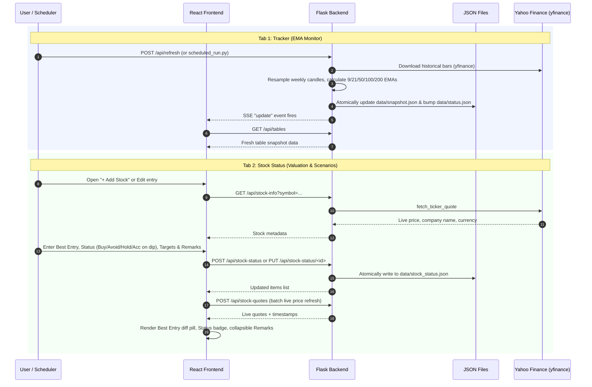
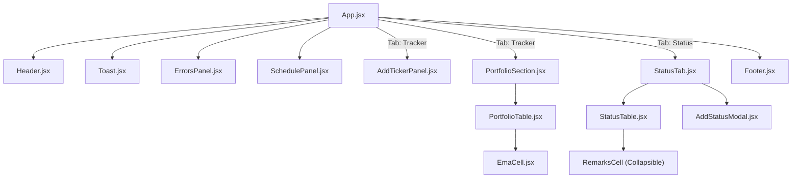

# Project Knowledge Graph: Portfolio and Stock Monitor

A comprehensive architectural map and reference guide for AI agents and developers. Consult this document to quickly locate relevant modules, understand component relationships and data flows, and make targeted modifications without re-reading the full codebase.

---

## 1. System Architecture Overview

The application is a local desktop financial dashboard that monitors Indian equity markets (NSE/BSE). It operates as a **React single-page application** served by a **lightweight Python Flask backend**, running either as a native desktop window (via `pywebview`) or in any standard web browser.

### Key Technology Stack
- **Frontend**: React 18, Vite 6, Bootstrap 5.3, Lucide React (icons), vanilla CSS (`custom.css`).
- **Backend**: Python 3.10+, Flask (routes & SSE server), pywebview (desktop shell), yfinance (market data).
- **Automation / Scheduling**: Windows Task Scheduler invoking PowerShell background runner scripts.
- **Inter-Process Coordination**: Shared SQLite databases in WAL mode with Server-Sent Events (SSE) push notifications.
- **Data Persistence**: Two SQLite databases (`stockmon.db` for durable user data + `screener_cache.db` for disposable market cache) with automated online gzip backups.

---

## 2. Core Architecture & Data Flow Diagrams

### High-Level System Topology

```mermaid
flowchart TB
    subgraph Sched [Scheduler & Background Process]
        WTS[Windows Task Scheduler] -->|weekdays 09:30, 11:30| PS[scripts/run_scheduled.ps1]
        PS --> SR[scheduled_run.py]
        SR -->|Fetch data & compute EMAs| YF1[yfinance / EMA Engine]
        SR -->|Transactional Write| DB[(data/stockmon.db - WAL)]
        SR -->|Online Gzip Backup| BK[backups/stockmon-*.db.gz]
        SR -->|Prune >60 days| SDB[(data/screener_cache.db - WAL)]
        SR -->|Popup on top| SW[show_window.py]
    end

    subgraph Backend [Flask Application Process]
        APP[app.py / pywebview] --> FLASK[Flask Server (stockmon.web)]
        FLASK -->|SSE Stream /api/stream| SSE[SSE Watcher]
        FLASK -->|REST API| ROUTES[stockmon/web/routes.py]
        ROUTES -->|Repositories| REPOS[stockmon/db/repositories/*]
        REPOS -->|Read/Write Durable| DB
        REPOS -->|Read/Write Disposable| SDB
        ROUTES -->|Read/Write Settings| CFG[config/settings.json]
    end

    subgraph Frontend [React SPA (frontend/dist)]
        UI[App.jsx]
        UI --> TAB1[Portfolio Tracker Tab]
        UI --> TAB2[Stock Status Tab]
        UI --> TAB3[Screener Tab]
        TAB1 --> PTABLE[PortfolioTable.jsx]
        TAB2 --> STABLE[StatusTable.jsx]
        TAB2 --> SMODAL[AddStatusModal.jsx]
        SSE -.->|Push Event| UI
    end
```

### Dual-Tab Operational Flows



---

## 3. Directory Map & Code Locations

```
Daily Updater/
├── app.py                     # Primary desktop entry point (launches Flask in daemon thread + pywebview)
├── show_window.py             # Focuses or restores the application window after scheduled refresh
├── scheduled_run.py           # CLI script triggered by Windows Task Scheduler (auto-prunes & backs up)
├── config/                    # Configuration storage
│   ├── settings.json          # Schedule times, timezone, task name, EMA periods, retention days
│   └── portfolios.json        # Legacy JSON seed file (imported into SQLite)
├── data/                      # SQLite runtime stores (WAL mode)
│   ├── stockmon.db            # Durable DB: portfolios, pending additions, sync state, snapshots, status
│   └── screener_cache.db      # Disposable DB: screener day metadata and indexed row data (promoted hot cols)
├── backups/                   # Online consistent gzip database snapshots & manifests
│   ├── manifest.json          # Checksums, timestamps, row counts, and schema versions
│   └── stockmon-*.db.gz       # Compressed point-in-time snapshots of stockmon.db
├── docs/                      # Architectural and technical documentation
│   ├── DATA_STORAGE_MIGRATION.md # Data storage architecture review, rationale, and completed migration plan
│   └── KNOWLEDGE_GRAPH.md     # [This file] Fast architectural lookup and module map
├── frontend/                  # React Single-Page Application (Vite project)
│   ├── package.json           # Dependencies (React 18, Bootstrap 5.3, Lucide React, Vite 6)
│   ├── vite.config.js         # Dev proxy config (/api -> http://127.0.0.1:5000)
│   ├── dist/                  # Production bundle (HTML, JS, CSS) served by Flask
│   └── src/
├── stockmon/                  # Python backend application package
│   ├── __init__.py
│   ├── paths.py               # Centralized path resolver (configurable via env variables)
│   ├── jsonstore.py           # Legacy atomic JSON helper (used for settings.json & export)
│   ├── logging_config.py      # Multi-handler rotating log setup (app.log, scheduler.log)
│   ├── errors.py              # Custom exceptions (ValidationError, DataFetchError)
│   ├── config_manager.py      # Loader and updater for settings.json
│   ├── portfolio.py           # Portfolios, ticker validation, TradingView links (delegates to DB repo)
│   ├── data_fetcher.py        # yfinance market data downloader with quote cache in DB
│   ├── ema.py                 # EMA calculation and Friday-anchored weekly candle resampling
│   ├── screener.py            # Screener API client, daily nonce handling, and DB storage
│   ├── multi_day_analyzer.py  # Multi-day sequence analyzer querying screener_cache.db hot columns
│   ├── service.py             # Orchestration service: fetch -> EMA -> snapshot -> status version bump
│   ├── status.py              # Status version store management (delegates to DB repo)
│   ├── stock_status.py        # Storage and CRUD operations for stock status (delegates to DB repo)
│   ├── db/                    # SQLite database engine, lifecycle, migrations, and backups
│   │   ├── __init__.py        # connect(), thread-local getters, health checks, open_database()
│   │   ├── migrations.py      # PRAGMA user_version schema migration runner
│   │   ├── schema_v1.sql      # Schema for stockmon.db (portfolios, status, snapshots, quotes)
│   │   ├── schema_screener.sql# Hybrid schema for screener_cache.db (hot columns + payload)
│   │   ├── backup.py          # Online backup API, gzip compression, GFS rotation, and restore
│   │   └── repositories/      # Repository layer isolating all raw SQL
│   │       ├── portfolios.py  # Portfolio and pending addition queries
│   │       ├── quotes.py      # Quote cache queries
│   │       ├── screener.py    # Screener day/row queries, bulk inserts, retention pruning
│   │       ├── snapshots.py   # Tracker snapshot storage
│   │       ├── stock_status.py# Stock status CRUD queries
│   │       └── sync_state.py  # SSE sync_state version bump queries
│   └── web/                   # Flask web application
│       ├── __init__.py        # Flask app factory (serves frontend/dist)
│       └── routes.py          # API route definitions, SSE stream, backup & restore endpoints
└── scripts/                   # Windows Task Scheduler & migration automation scripts
    ├── migrate_to_sqlite.py   # Re-runnable, idempotent JSON to SQLite database importer
    ├── export_to_json.py      # Escape-hatch export from SQLite back to JSON
    ├── register_task.ps1      # Registers/updates the task in Windows Task Scheduler
    ├── run_scheduled.ps1      # PowerShell execution script run by Task Scheduler
    └── run_scheduled.bat      # Batch wrapper for run_scheduled.ps1
```

---

## 4. Component Hierarchy & State Flow



### State Management Guidelines
- **Global Data**: Handled in `App.jsx` via `loadData()` and `api.subscribeToUpdates()`. It maintains the Tracker table data, errors, and scheduled times.
- **Status Tab Data**: Managed in `StatusTab.jsx` (`items`, `liveQuotes`, `searchTerm`, `selectedHistoryMap`).
- **Modal State**: Managed in `AddStatusModal.jsx` (symbol, stockName, priceOfAnalysis, bestEntry, status, base, bull, bear, remarks). Form changes are committed via `handleModalSubmit`.

---

## 5. Data Contracts & Persistence Schemas

### `data/stock_status.json` Record Schema
```json
{
  "id": "c154101a9a22",
  "symbol": "LORDSMARK.BO",
  "name": "Lord's Mark Industries Limited",
  "date_of_analysis": "2026-09-02",
  "price_of_analysis": 81.11,
  "best_entry": 75.0,
  "status": "Buy",
  "currency": "INR",
  "base": ["93", "4.6"],
  "bull": ["139", "19"],
  "bear": ["62", "-8.6"],
  "remarks": "- Multi-line remarks text preserved with exact line breaks and formatting...",
  "created_at": "2026-09-02T19:53:10.347524",
  "updated_at": "2026-09-02T20:25:00.123456"
}
```

### Status Dropdown & Badge Values
| Value | Badge Class | Color | Meaning |
| :--- | :--- | :--- | :--- |
| `Buy` | `.status-badge-buy` | Rich Green (`#15803d` / `#dcfce7`) | Strong buy candidate at current/entry level |
| `Avoid` | `.status-badge-avoid` | Red (`#b91c1c` / `#fee2e2`) | Avoid or high downside risk |
| `Hold` | `.status-badge-hold` | Yellow (`#b45309` / `#fef3c7`) | Neutral / wait and hold |
| `Acc on dip` | `.status-badge-acc-on-dip` | Light Green / Mint (`#065f46` / `#d1fae5`) | Accumulate on price retracements |

### Percentage Difference Formula (Shared Logic)
For both **Current Price** (vs Price of Analysis) and **Best Entry** (vs Current Price):
$$\text{diff} = \frac{\text{Current Price} - \text{Reference Price}}{\text{Reference Price}} \times 100$$
- Displayed with `+` sign if $\ge 0$.
- Colored with `.price-change-pill.pos` (green) or `.price-change-pill.neg` (red).

---

## 6. HTTP API Endpoint Matrix

| Method | Path | Handled In | Purpose | Request Body / Query |
| :--- | :--- | :--- | :--- | :--- |
| `GET` | `/api/tables` | `routes.py` | Full tracker tables + errors | None |
| `GET` | `/api/data` | `routes.py` | Raw `snapshot.json` | None |
| `POST` | `/api/refresh` | `routes.py` | Trigger full EMA re-fetch | None |
| `POST` | `/api/tickers` | `routes.py` | Add ticker to portfolio | `{"portfolio": "BAPA", "symbol": "TCS"}` |
| `DELETE` | `/api/tickers` | `routes.py` | Remove ticker | `{"portfolio": "BAPA", "symbol": "TCS"}` |
| `GET` | `/api/schedule` | `routes.py` | Get scheduled times | None |
| `POST` | `/api/schedule` | `routes.py` | Update scheduled times | `{"run_times": ["09:30", "11:30"]}` |
| `GET` | `/api/status` | `routes.py` | Get current data version | None |
| `GET` | `/api/stream` | `routes.py` | SSE push stream for version bump | Query: `?version=N` |
| `GET` | `/api/stock-info` | `routes.py` | Fetch live quote & company name | Query: `?symbol=INFY.NS` |
| `POST` | `/api/stock-quotes`| `routes.py`| Batch parallel quote fetch | `{"symbols": ["TCS.NS", "INFY.NS"]}` |
| `GET` | `/api/stock-status`| `routes.py`| List all status records | None |
| `POST` | `/api/stock-status`| `routes.py`| Create new stock status record | Status record payload |
| `PUT` | `/api/stock-status/<id>` | `routes.py` | Update existing status record | Updated fields payload |
| `DELETE`| `/api/stock-status/<id>` | `routes.py` | Delete status record | None |

---

## 7. Developer & Agent Cheat Sheet

When implementing new changes, refer to this table to minimize file exploration:

| Goal | Primary Files to Inspect / Modify |
| :--- | :--- |
| **Status Tab Columns or UI** | `frontend/src/components/StatusTable.jsx`, `frontend/src/components/StatusTab.jsx` |
| **Add/Edit Stock Modal** | `frontend/src/components/AddStatusModal.jsx` |
| **Stock Status Backend Storage** | `stockmon/stock_status.py`, `stockmon/web/routes.py` |
| **Tracker Table or EMAs** | `frontend/src/components/PortfolioTable.jsx`, `stockmon/ema.py`, `stockmon/service.py` |
| **Market Data Fetching / yfinance** | `stockmon/data_fetcher.py`, `stockmon/portfolio.py` |
| **CSS Badges, Pills, Layouts** | `frontend/src/styles/custom.css` |
| **Task Scheduler & Automated Runs** | `stockmon/config_manager.py`, `scripts/register_task.ps1`, `scheduled_run.py` |
| **Frontend Production Build** | Run `npm run build` in `frontend/` (outputs to `frontend/dist/`) |
| **Backend Testing / Python Check** | Run `.\.venv\Scripts\python.exe` with `stockmon` imports |
